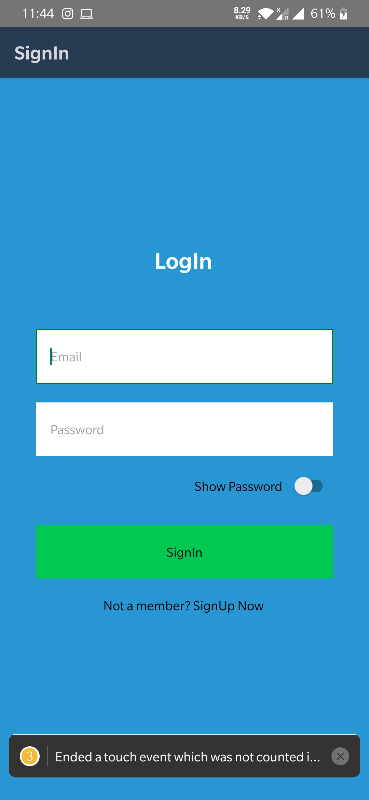
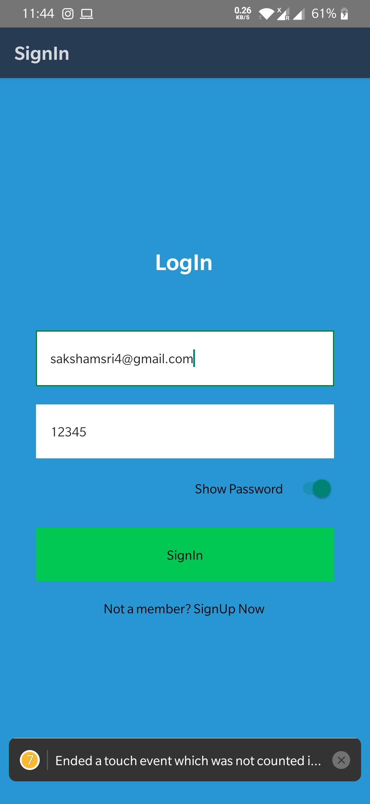
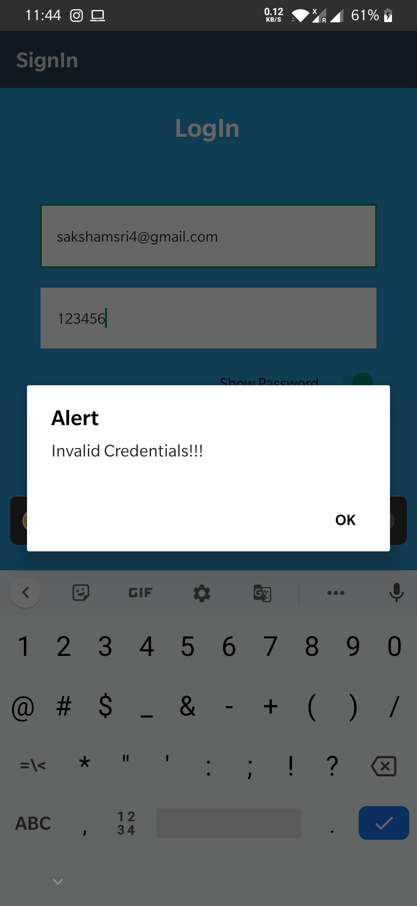
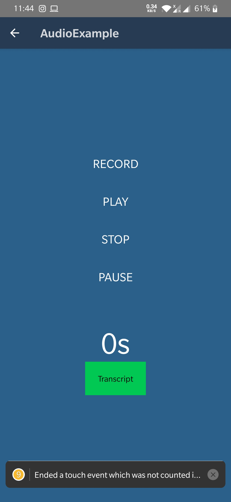
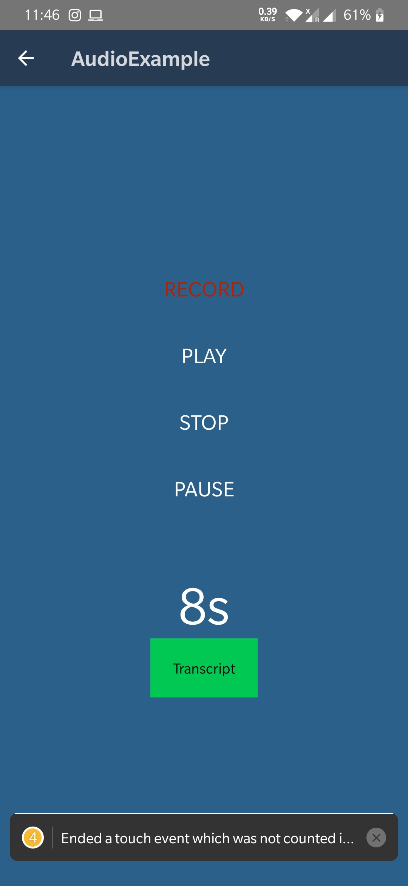
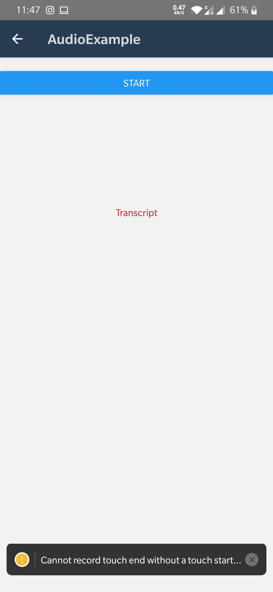
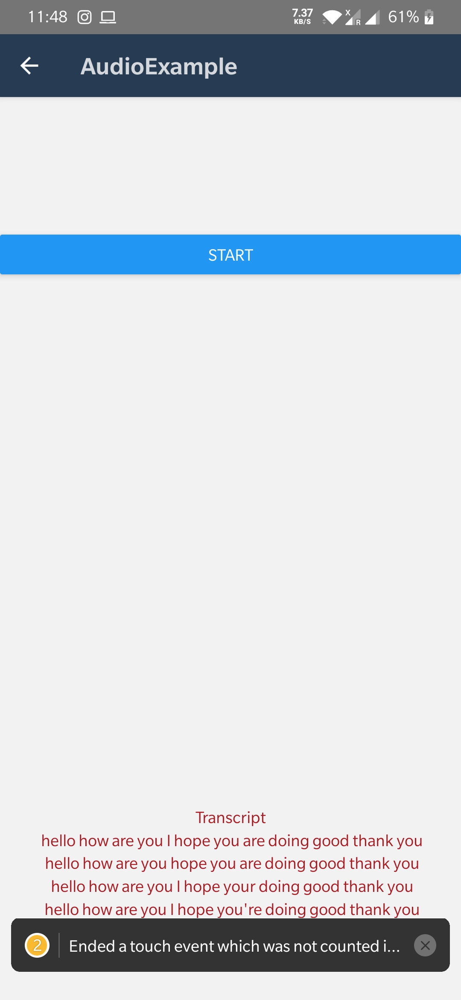

<h2> React Native Cross-Platform mobile App </h2>

<h4>Features of the app:</h4> 
1. User Login with username and password. 
2. Email valdation for username.  
2. Show password toggle option.  
3. Audio recording and playing.  
4. Voice transript of the audio.    

<h4>Packages Used:</h4>
1. react-native-audio --save 
2. react-native-voice --save 
3. react-native-sound --save 
4. react-navigation    

<h4>Screenshots:</h4>

